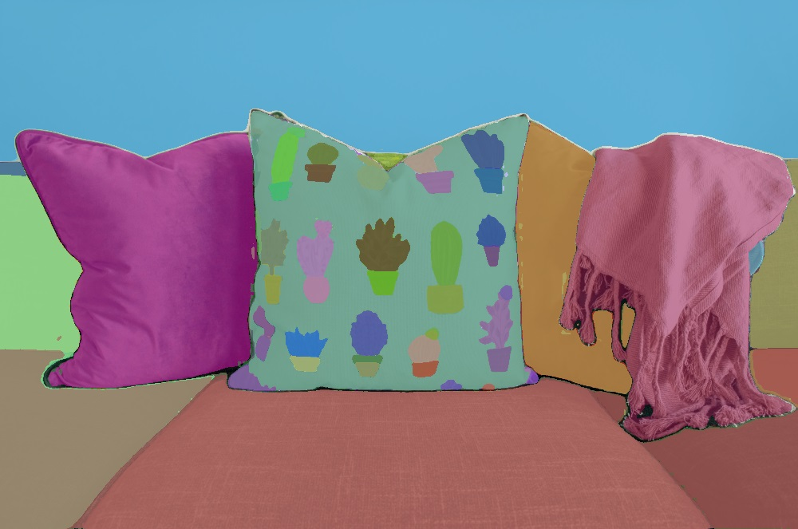
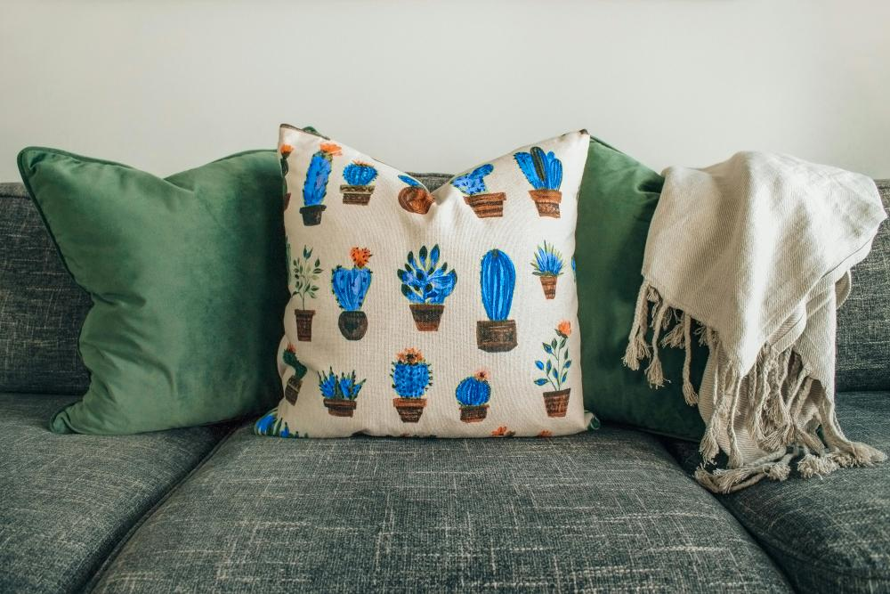
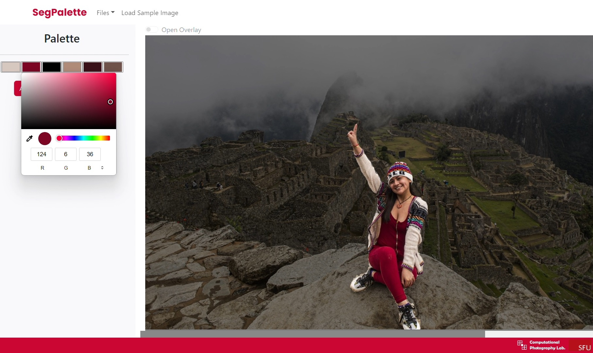

<!-- PROJECT LOGO -->
<div align="center">
  <a href="https://github.com/andreihar/segpalette">
    
  </a>
  
# SegPalette


<!-- PROJECT SHIELDS -->
[![Contributors][contributors-badge]][contributors]
[![Licence][licence-badge]][licence]

**Instance Recolouring by Palette Generation after Instance Segmentation**

A tool for recolouring images by generating segmented instances and applying customised colour palettes to enhance visual appeal.

<div style="position: relative; max-width: 600px;">
  <a href="https://youtu.be/7FBLZdGhSWw">
    
    <div style="position: absolute; top: 0; left: 0; width: 100%; height: 100%; background: #FFFFFF99;"></div>
    <div style="position: absolute; top: 50%; left: 50%; transform: translate(-50%, -50%);">
      
    </div>
  </a>
</div>

</div>


---


<!-- TABLE OF CONTENTS -->
<details open>
  <summary>Table of Contents</summary>
  <ol>
    <li>
      <a href="#about-the-project">About The Project</a>
      <ul>
        <li><a href="#built-with">Built With</a></li>
      </ul>
    </li>
    <li>
      <a href="#install">Install</a>
      <ul>
        <li><a href="#prerequisites">Prerequisites</a></li>
        <li><a href="#clone-repository">Clone Repository</a></li>
        <li><a href="#frontend-setup">Frontend Setup</a></li>
        <li><a href="#backend-setup">Backend Setup</a></li>
      </ul>
    </li>
  </ol>
</details>


<!-- ABOUT THE PROJECT -->
## About The Project

SegPalette is a tool for instance recolouring, employing a novel approach of palette generation post-instance segmentation. It aims to enhance the visual aesthetics of segmented instances by applying customised colour palettes.

### Built With

* [![ReactJS][react-badge]][react]
* [![Flask][flask-badge]][flask]
* [![PyTorch][pytorch-badge]][pytorch]


<!-- INSTALL -->
## Install

### Prerequisites
- Node.js (v14.x or later)
- Python (v3.7 or later)

### Clone Repository
```bash
git clone https://github.com/andreihar/cmpt461.git
cd cmpt461
```

### Frontend Setup
```bash
cd client
npm install
npm run dev
```

### Backend Setup

Download pre-trained SAM model sam_vit_h_4b8939.pth from [here](https://dl.fbaipublicfiles.com/segment_anything/sam_vit_h_4b8939.pth) and place it in the `server` directory.

Install dependencies and run the server

```bash
cd server
pip install -r requirements.txt
python app.py
```

The website can be accessed through the URL `http://localhost:5173/`.


<!-- FUNCTIONAL AREAS -->
## Functional Areas

### Instance Segmentation

Instance segmentation within SegPalette is crucial for precise recolouring, enabling colour changes to be applied exclusively to selected objects without altering the entire image. This process primarily utilises the Segment Anything Model (SAM) developed by Meta AI, a robust vision transformer model known for generating highly accurate segmentation masks across diverse and complex image types. SAM's ability to delineate object boundaries with precision ensures that even in cluttered or intricate scenes, individual segments can be effectively isolated for targeted recolouring.

To enhance user flexibility, SegPalette also supports the use of pre-existing segmentation data through COCO segmentation files, allowing for custom segmentations tailored to specific objects or scenarios. After obtaining the segmentation masks—whether generated by SAM or provided via COCO files—these are decoded using Run-Length Encoding (RLE) to produce binary masks, which precisely define the boundaries of each object for the subsequent recolouring process.

<p align="center">

</p>

### Colour Palette Generation

The colour palette for each segmented instance is generated using a K-Means clustering algorithm. K-Means is a widely used method for partitioning data into distinct clusters, which in this context refers to grouping similar colours found within a segment. In SegPalette, we set the number of clusters (k) to 6, which strikes a balance between capturing the variety of colours within a segment and keeping the palette manageable for users to modify.

During the clustering process, the algorithm first initialises the cluster centroids based on the colours present within the segmented area. By focusing exclusively on the pixels inside the segmentation mask, the algorithm ensures that the palette accurately represents the colour distribution of the object or region of interest, rather than being influenced by surrounding areas. This approach results in a palette that is well-suited for recolouring tasks, as it reflects the true colour diversity within the segment, allowing for more precise and contextually appropriate colour adjustments.

<p align="center">

</p>

### Recolouring

Recolouring in SegPalette focuses on altering the chromaticity of colours while preserving the luminance, ensuring that the image’s brightness remains consistent for a realistic appearance. This is achieved using the LAB colour space, where the 'L' channel represents luminance, and the 'a' and 'b' channels represent the colour's green-red and blue-yellow components, respectively. This space is ideal for tasks requiring perceptually uniform colour changes, as it allows for precise adjustments without compromising the natural look of the image.

During the recolouring process, SegPalette modifies the 'a' and 'b' channels of the LAB representation to match the selected colours from the generated palette. By calculating the difference between the original and target colours and applying it to these channels, the segment’s colour shifts while the 'L' channel remains unchanged. This method ensures that the original shading and depth are preserved, making the recoloured segments appear natural and integrated within the overall image.

<p align="center">

</p>

### Web Application

The SegPalette web application provides an intuitive interface for real-time interactive recolouring. Users can select and modify colours of individual segments through a responsive colour picker, receiving instant visual feedback to easily experiment with various colour schemes. To enhance precision, the app features a toggle for the segmentation overlay, allowing users to compare the recoloured image with the original and fine-tune adjustments for the desired result.

In addition to recolouring, the application supports exporting both the final images and the segmentation data in COCO format, facilitating easy sharing, future edits, or further processing. Built with ReactJS for a responsive user experience and powered by Flask on the backend for efficient processing, the app is designed to be both accessible and robust, serving the needs of both casual users and professionals.

<p align="center">

</p>

#### MATLAB Recolouring

<div align="center">
<div style="position: relative; max-width: 400px;">
  <a href="https://youtu.be/3s16IgF_vp0">
    
    <div style="position: absolute; top: 0; left: 0; width: 100%; height: 100%; background: #FFFFFF99;"></div>
    <div style="position: absolute; top: 50%; left: 50%; transform: translate(-50%, -50%);">
      
    </div>
  </a>
</div>
</div>

The recolouring feature, initially intended for the SegPalette web app, was not implemented due to unforeseen project challenges. However, to demonstrate the functionality, we provided Python and MATLAB scripts that allow users to generate binary masks from segmentation data and perform recolouring using MATLAB. This alternative approach validates the concept, proving the effectiveness of our recolouring method even without full web app integration.

#### Run

To generate binary masks, use the decode_rle.py script from the command line:

```bash
cd matlab
pip install pycocotools-windows # For Windows
pip install pycocotools # Otherwise
python decode_rle.py SOURCE_IMAGE.jpg SEGMENTATION_FILE.json
```

Once you have the binary masks, load the `palette_demo.m` script in MATLAB and follow the comments to generate palettes and perform the recolouring.


<!-- MARKDOWN LINKS -->
<!-- Badges and their links -->
[contributors-badge]: https://img.shields.io/github/contributors/andreihar/segpalette?style=for-the-badge&color=44cc11
[contributors]: #contributors
[licence-badge]: https://img.shields.io/github/license/andreihar/segpalette.svg?color=000000&style=for-the-badge
[licence]: LICENSE
[react-badge]: https://img.shields.io/badge/React-087EA4?style=for-the-badge&logo=react&logoColor=ffffff
[react]: https://react.dev/
[flask-badge]: https://img.shields.io/badge/Flask-000000?style=for-the-badge&logo=flask&logoColor=white
[flask]: https://flask.palletsprojects.com/
[pytorch-badge]: https://img.shields.io/badge/PyTorch-EE4C2C?style=for-the-badge&logo=pytorch&logoColor=white
[pytorch]: https://pytorch.org/